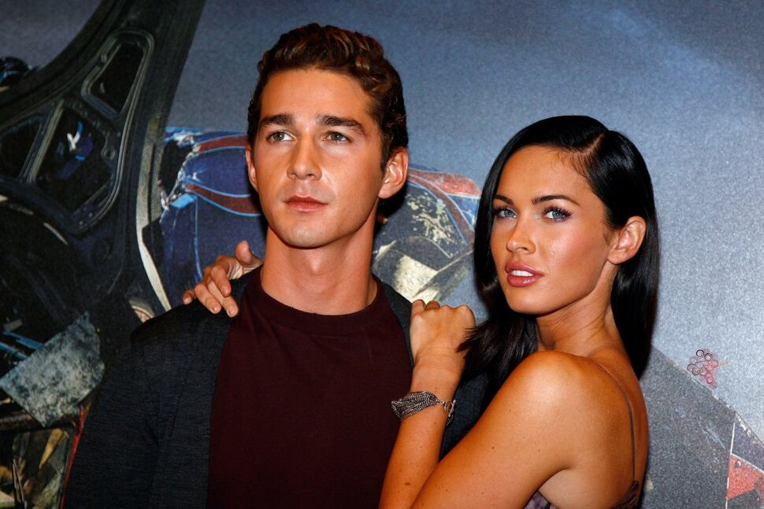
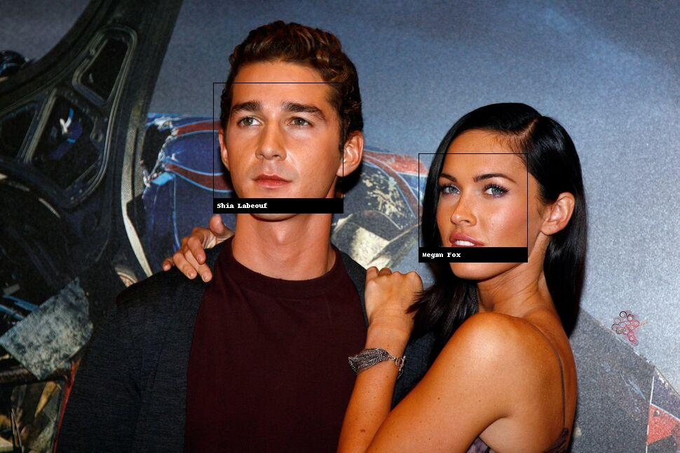

# face-finder-truncator
A demonstration of using python library face recognition for analyzing pictures in terms of faces, cutting them off and etc.

In order to use that library on Windows OS make sure you have pip3 installed along with the cmake

run the following command

pip3 install cmake

After completing and setting everything up we can move on to the good stuff.

First of all, we can give and image as an input and on the output we receive the number of faces on that picture.

For instance, this one is an input: 

And on the output we get

Alright, sweet. Moving on...

Next thing you could do is if you have an image with several people on it, just like in the previous example, you could crop their faces out with just a couple lines of code:

    face_image = image[top:bottom, left:right]
    pil_image = Image.fromarray(face_image)

For the input we get this one: 

And after the magic applied we get those: 

Alright.

Also what you could do, if for 1 person you got the encodings for his face, which again you can get in 1 line of code as shown in the recognize.py file, you can indentify him on another picutre, put a square around his/her face and append a label on top of it, let's have a look. 

As the input we're gonna need a little bit more. To get the encoding of faces these 2:

And the picutre that we're gonna identify them on is this one:

This one is a bit more complicated but still a piece of cake. We just need to use the Pillow library which will give us the ability to draw on top of the image which we need.

And as the result we get this thing of beauty:

You can see how nicely it drew the rectangles around their faces according to the obtained coordinates and put a label with their names. Good job!